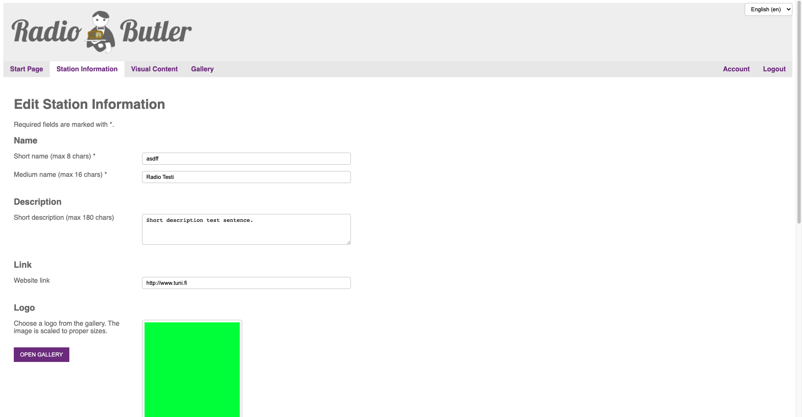

###################
Station Info
###################

To get started, you need to input the informative content of your station to Radio Butler first. This happens in a station info -view.

#. **Station Name**

   Input your station’s name. Type short name and medium name separately. The character limit for the short name is 8 characters, and for the medium name 16 characters.

#. **Description**

   Write a short description about your station. The maximum length of a description is 180 characters.

#. **Link**

   Type a link to your radio station’s website, so that your listeners can visit.

#. **Logo**

   Place the station logo. The logo is shown to viewers during a broadcast. **Please notice that the ideal size of the logo is 600x600px.** The logo is scaled to appropriate size, but to avoid any quality problems please stick to ideal size.

   Type short name and medium name separately. The character limit for the short name is 8 characters, and for the medium name 16 characters.

   .. image:: images/EnStationinfo2.png
     :width: 400
     :alt: Station info

#. **Bearers**

   Add the bearer information.

   **Bearer 1**

   Platform: Platform is automatically set on FM-RDS.

   RDS ECC: Add your location’s Extended Country Code (ECC), for example Finland’s ECC is E1.

   RDS PI: Add your radio station’s PI code.

   Frequency (MHz): Add your radio station’s frequency.

   **Bearer 2**

   Platform: Platform is automatically set on IP.

   IP URL:  Add the URL of your audio stream. (e.g. \http://...\)

   MIME: Add the MIME type of your audio stream. This is important so that devices know if they support your stream type or not. Your streaming provider can tell what MIME -type to use for each stream (e.g. audio/aacp).

   IP Bitrate (kbps): Add the bitrate of your stream.

   **RadioDNS parameters**

   These parameters help IP-connected devices find more of your RadioDNS Hybrid Radio services. Please notice that these parameters are mandatory.

   **FQDN** = Add the Fully Qualified Domain Name that your RadioDNS Registration uses.

   **Service Identifier** = Add the service identifier. A unique identifier to this service.

   For further information about the registration, please check RadioDNS website: https://radiodns.org/