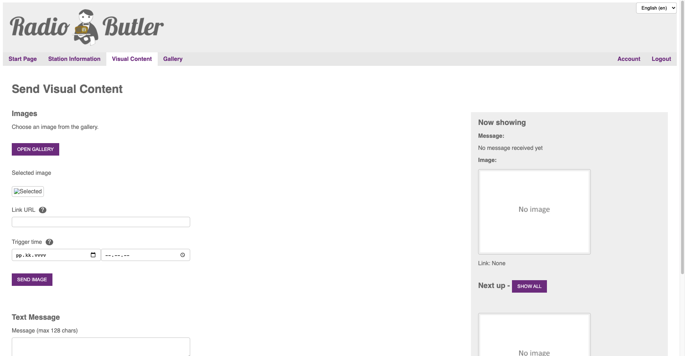

###################
Visual Content
###################

When you have saved the station info, you are ready to send visual content to your listeners. This happens in a visual content -view.

**Pictures**

#. **Add pictures to the gallery**

   First, you might want to add content to the gallery, so that you have the content ready for the broadcast. You can add as many pictures as you want. Please remember that due to legal issues the pictures used during the broadcast must be saved for at least 21 days after the broadcast. The system saves the content automatically for that period.

#. **Set link and timing for the content**

   Now set the link you want to associate with the visual content and then set the timing for the content to be shown. If you don’t set specific time, the content is shown immediately.

**Text**

Add text content for maximum of 128 of total length. The text content is sent separately from the picture content. **The text content is always shown immediately after sending.**

**Now showing**

Shows you the content currently on the air and the content that will be aired next.

Show all: shows the full queue of content that will be aired.